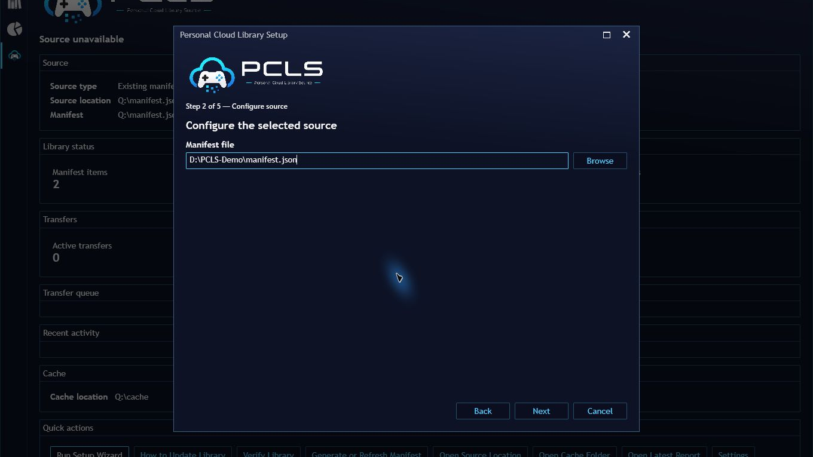
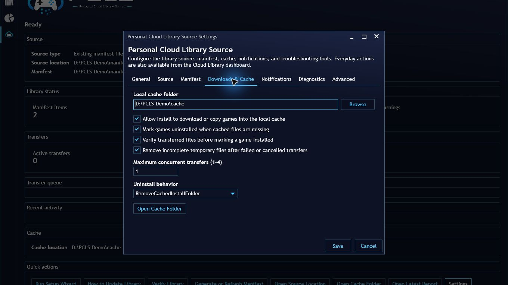
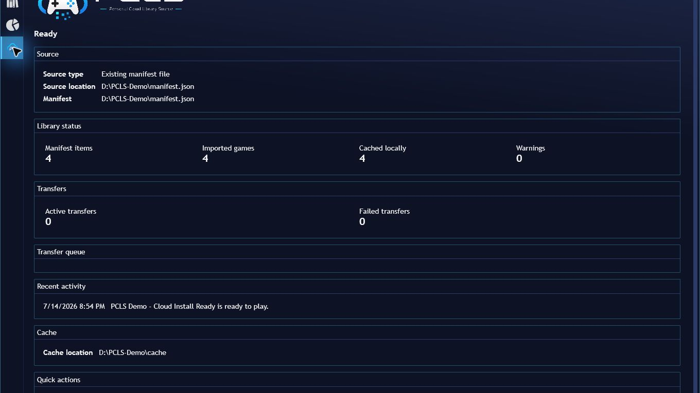
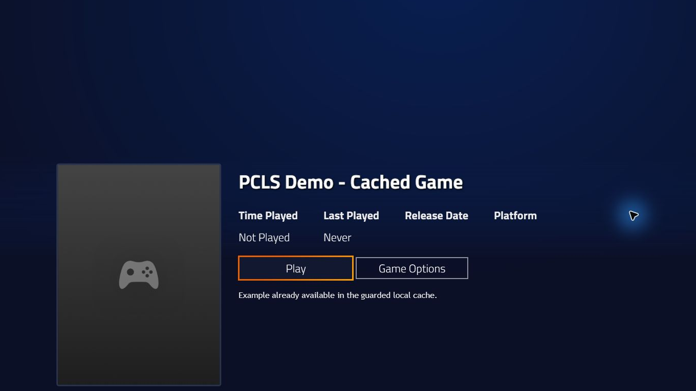

# Personal Cloud Library Source

Personal Cloud Library Source (PCLS) is a Playnite `GameLibrary` plugin that imports a user-supplied manifest for a personal cloud, NAS, external-drive, or local library. It catalogs content; it does not provide or stream games.

## Current status

The live development version is `0.3.2`. This branch is the 1.0 release candidate, but it is not a published 1.0 release. Installed-provider, Fullscreen, upgrade, and final package qualification remain release gates; see [Known limits](docs/known-limits.md).

## Release-candidate tour

The screenshots below use a disposable demonstration library. They show the real current plugin UI without private library data.

### Guided setup

Choose an existing manifest or a library root in the Desktop setup wizard.

### Provider and manifest settings

Provider-specific fields keep local-file, local-folder, and rclone configuration focused.

### Guarded cache behavior

The cache page groups install, verification, cleanup, concurrency, and safe uninstall controls.

### Dashboard and transfers

The Desktop dashboard summarizes the source, catalog, cache, warnings, queue, and recent activity.

### Normal Playnite controls

Catalog-only and cached games appear in the normal Desktop library. Standard Playnite controls also remain available in Fullscreen after setup is completed in Desktop.

## Supported providers

- `LocalFile`: reads a JSON manifest from a local path. Content sources may be absolute or relative to the manifest folder.
- `LocalFolder`: reads a manifest beneath a library root and copies selected files or directories into the local cache.
- `RcloneRemote`: reads and downloads through a user-configured rclone remote.

Local folders can point at fixed disks, external drives, mapped drives, UNC/NAS paths, or synced cloud folders. Availability, credentials, and stable drive mappings remain the user's responsibility.

## Setup

Open **Add-ons -> Extension settings -> Libraries -> Personal Cloud Library Source** in Playnite Desktop, or use the Desktop setup wizard.

For local or NAS content:

1. Select `LocalFile` or `LocalFolder`.
2. Choose the manifest file or library root and relative manifest path.
3. Choose a local cache folder.
4. Run **Verify setup**, save settings, and run **Update Game Library**.

For `RcloneRemote`:

1. Install rclone separately and run `rclone config`.
2. Confirm the remote with `rclone listremotes` and test the manifest with `rclone cat remote:path/to/manifest.json`.
3. Enter the executable path, remote name, manifest path, optional content root, and timeout in PCLS.
4. Run **Test rclone connection** and **Verify setup**, save settings, and update the library.

The default configured rclone timeout is 90 seconds, with accepted values from 5 to 300 seconds. Manifest `rclone cat` reads and the settings `rclone listremotes` test use it as a total process deadline. Queued downloads instead require first output or error activity within at most 30 seconds, then apply the configured timeout between later activity; an active transfer may therefore run longer than 90 seconds.

Detailed guides:

- [Setup wizard](docs/setup-wizard.md)
- [Local folder, external drive, and NAS setup](docs/setup-local-folder.md)
- [Rclone setup](docs/setup-rclone.md)
- [Manifest format](docs/manifest-format.md)
- [Automatic manifest generation](docs/automatic-manifest-generation.md)

## Game and cache behavior

Manifest entries import as normal Playnite games with stable IDs. A valid cached launch path is shown as installed and playable; a missing cache path can remain visible as uninstalled. Eligible entries can be copied or downloaded to the cache. Transfers are queued, can be cancelled or retried, and verify destination existence/size before completion.

Cache deletion is deliberately narrow. Uninstall removes only an authorized cached file or install folder. It refuses filesystem roots, the cache root itself, paths outside the configured cache by default, and unsafe reparse-point paths. It never deletes the manifest, local source library, or rclone remote content.

## Desktop and Fullscreen

Desktop owns setup, settings, manifest generation, verification reports, the dashboard, and custom details views. Fullscreen does not have a dedicated setup wizard or dashboard.

Imported game metadata and standard Playnite play/install/uninstall controllers do not depend on Desktop-only windows. Notifications provide workflow feedback outside those windows. Automated contracts cover this boundary, but the installed Fullscreen matrix has not yet been manually qualified.

## Upgrades

Settings migration is sequential and preserves configured values while applying safer defaults. In particular, the former default 30-second rclone timeout migrates to 90 seconds, while custom timeout values remain unchanged. Back up Playnite data before upgrading and verify provider/cache paths afterward. See [Upgrades](docs/upgrades.md).

## Troubleshooting, diagnostics, and reports

Start with **Verify setup** and review the latest verification report. Import diagnostics, when enabled, and generated reports are written beneath the plugin user-data directory, never the extension install directory. Reports use summaries and capped samples rather than dumping a complete private manifest.

- [Troubleshooting](docs/troubleshooting.md)
- [Reports and diagnostics](docs/reports-and-diagnostics.md)

## Legal-use boundary

PCLS does not provide games, ROMs, BIOS files, cracks, keys, copyrighted content, storefront access, scraping, or download sources. Users must only index and copy content they own or have rights to use and must configure their own storage providers. See [Legal use](docs/legal-use.md).

## Known limits

PCLS is a catalog-and-cache workflow, not streaming. It does not auto-download a whole library at startup. Dedicated Fullscreen management UI is out of scope. Removable/mapped/NAS availability and real-provider behavior depend on the environment and still require installed qualification. See the complete [Known limits](docs/known-limits.md).

## Development and packaging

See [Development](DEVELOPMENT.md), [Contributing](CONTRIBUTING.md), and [Security](SECURITY.md). Distribution metadata lives in `PersonalCloudLibrarySource/extension.yaml` and `playnite-addon/`; the stable `AddonId` is `PersonalCloudLibrarySource_61993828-67a8-4468-93a2-293442e36328`.
