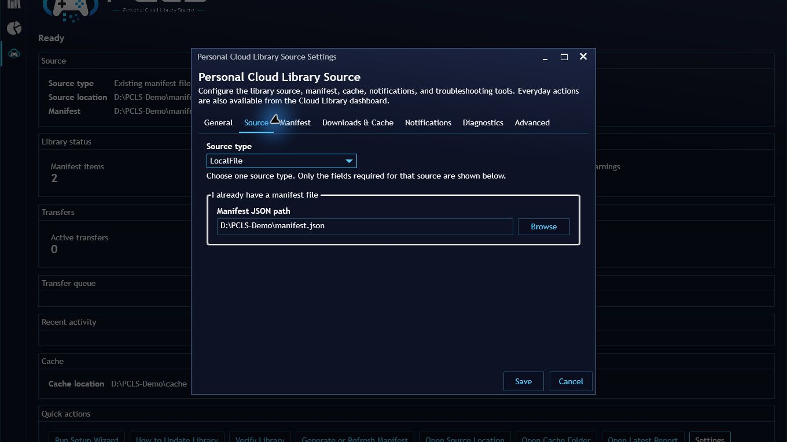

# Personal Cloud Library Source


Personal Cloud Library Source imports a user-supplied cloud, NAS, external-drive, or local manifest into Playnite's normal library view. Cloud-only entries can appear before download, be enriched with Playnite metadata, downloaded or copied to a local cache when needed, launched locally, and later uninstalled from cache while keeping the catalog entry.

Manifest generation update completed 6/2/2026

## Overview

The plugin catalogs user-supplied entries and copies or downloads user-owned files from configured local folders or rclone remotes.

Generate manifests from local folders, external drives, mapped drives, NAS paths, or rclone cloud remotes with `tools/generate-manifest.ps1`.

Local folders, external drives, mapped drives, and NAS paths do not require rclone. rclone is optional and only needed for rclone cloud scanning.

## How This Works


Personal Cloud Library Source lets users keep a record of their personal cloud, NAS, external-drive, or local library inside Playnite. Entries can appear before they are downloaded, so the library can be organized, filtered, and enriched with metadata first, then cached locally later.

This supports a download/cache workflow:

1. Import entries from a user-supplied manifest.
2. View and organize those entries inside Playnite.
3. Use Playnite's metadata tools to add covers, descriptions, genres, screenshots, and other details.
4. Download or copy selected entries to a local cache when ready.
5. Launch cached entries locally through Playnite.
6. Remove cached copies later while keeping the catalog entry in the library.

This is not a gameplay streaming service. It does not provide games, ROMs, BIOS files, cracks, keys, copyrighted content, scraping, storefront access, or download sources. It catalogs user-supplied entries and copies or downloads user-owned files from configured local folders or rclone remotes.

## Features

- Normal Playnite `GameLibrary` integration.
- Provider modes for `LocalFile`, `LocalFolder`, and `RcloneRemote`.
- Local folder, external drive, mounted drive, and NAS support.
- Google Drive, OneDrive, Dropbox, and other cloud providers through rclone.
- Universal manifest generation from filesystem roots or rclone remotes.
- Cloud-only entries imported as uninstalled.
- Cached entries imported as installed with a Play action.
- Manual `Download to local cache` action when a provider can resolve `sourcePath`.
- Manual `Remove cached copy` action for installed/cached entries.
- Optional import diagnostics.
- Customizable library display name inside Playnite.

## Playnite Metadata

Imported entries behave like normal Playnite library entries. After import, users can use Playnite's existing metadata download tools and metadata providers to add covers, descriptions, genres, screenshots, and other details.

Metadata can be prepared before downloading or installing the actual file, as long as the entry exists in Playnite. Cached or downloaded entries can then launch normally.

## What This Plugin Does Not Provide

This is not a gameplay streaming service. It does not provide games, ROMs, BIOS files, cracks, keys, copyrighted content, scraping, storefront access, or download sources. It catalogs user-supplied entries and copies or downloads user-owned files from configured local folders or rclone remotes.

## Manifest Generator

Use `tools/generate-manifest.ps1` to build a v3 manifest from user-owned files that already exist in a local folder, external drive, mapped drive, NAS path, or rclone remote.

Filesystem:

```powershell
.\tools\generate-manifest.ps1 `
  -SourceRoot "D:\Games" `
  -OutputPath ".\personal-cloud-library.generated.json" `
  -Overwrite
```

External drive:

```powershell
.\tools\generate-manifest.ps1 `
  -SourceRoot "E:\ROMs" `
  -OutputPath ".\personal-cloud-library.generated.json" `
  -Overwrite
```

Mapped drive:

```powershell
.\tools\generate-manifest.ps1 `
  -SourceRoot "Z:\ROMCade" `
  -OutputPath ".\personal-cloud-library.generated.json" `
  -Overwrite
```

NAS:

```powershell
.\tools\generate-manifest.ps1 `
  -SourceRoot "\\NAS\Games" `
  -OutputPath ".\personal-cloud-library.generated.json" `
  -Overwrite
```

Rclone:

```powershell
.\tools\generate-manifest.ps1 `
  -RcloneRemoteRoot "gdrive:RomCade" `
  -OutputPath ".\personal-cloud-library.generated.json" `
  -Overwrite
```

Dry run:

```powershell
.\tools\generate-manifest.ps1 `
  -SourceRoot "D:\Games" `
  -DryRun
```

## Installation for Users

The recommended way to install **Personal Cloud Library Source** is through Playnite's official add-on browser.

1. Open Playnite.
2. Go to **Main Menu → Add-ons**.
3. Open **Browse**.
4. Search for **Personal Cloud Library Source**.
5. Select the add-on and click **Install**.
6. Restart Playnite when prompted.
7. Open the plugin settings and choose a provider mode.
8. Run **Update Game Library**.



The provider settings choose where the manifest is read from. The cache settings choose where files are downloaded or copied before Playnite launches them.

Users who prefer manual installation can also download the packaged `.pext` file from the GitHub Releases page and open it with Playnite.

## Requirements

- Playnite installed.
- A user-created manifest file.
- A local cache folder where downloaded or copied entries can be stored.
- rclone, only if using the `RcloneRemote` provider mode.

Local files, external drives, mapped drives, and NAS paths do not require rclone unless the user chooses to use rclone for that setup.

## Building From Source for Developers

1. Build the project using **Debug Any CPU**.
2. Add the build output folder as a Playnite external extension:

   ```text
   D:\PersonalCloudLibrarySource\PersonalCloudLibrarySource\bin\Debug
   ```

3. Restart Playnite.
4. Configure a test manifest and run **Update Game Library**.

To create a local `.pext` package for testing or manual installation:

```powershell
.\tools\package-extension.ps1
```

For normal user installation, use Playnite's official add-on browser instead of building from source.

## Provider Modes

### LocalFile

Reads a manifest from `LocalManifestPath`.

If downloads are enabled, `sourcePath` can be absolute or relative to the manifest folder.

### LocalFolder, External Drive, or NAS

Reads a manifest from:

```text
LocalLibraryRoot + ManifestRelativePath
```

Copies item files from:

```text
LocalLibraryRoot + sourcePath
```

Use this mode for local folders, external drives, mapped drives, and NAS paths.

### RcloneRemote

Reads a manifest with:

```text
rclone cat remote:manifestPath
```

Copies item files with:

```text
rclone copyto remote:sourcePath localCachePath
```

Use this for Google Drive, OneDrive, Dropbox, and other providers supported by rclone.

## LocalFile Setup

```text
SourceProviderType = LocalFile
LocalManifestPath = D:\PersonalCloudLibrarySource\samples\personal-cloud-library.sample.json
LocalCacheFolder = D:\PersonalCloudLibraryCache
AllowDownloads = true
TreatMissingFilesAsUninstalled = true
EnableDiagnostics = true
```

## LocalFolder, External Drive, or NAS Setup

```text
SourceProviderType = LocalFolder
LocalLibraryRoot = E:\PersonalLibrary
ManifestRelativePath = personal-cloud-library.sample.json
LocalCacheFolder = D:\PersonalCloudLibraryCache
AllowDownloads = true
```

NAS example:

```text
LocalLibraryRoot = \\NAS\PersonalLibrary
```

## Google Drive via Rclone Setup

Configure a Google Drive remote with `rclone config`, then map the plugin settings:

```text
SourceProviderType = RcloneRemote
RcloneExecutablePath = rclone
RcloneRemoteName = google_drive
RcloneManifestPath = PersonalLibrary/personal-cloud-library.sample.json
RcloneContentRoot = PersonalLibrary/files
RcloneTimeoutSeconds = 30
LocalCacheFolder = D:\PersonalCloudLibraryCache
AllowDownloads = true
```

## OneDrive via Rclone Setup

Configure a OneDrive remote with `rclone config`, then use the same `RcloneRemote` settings pattern:

```text
RcloneRemoteName = onedrive
RcloneManifestPath = PersonalLibrary/personal-cloud-library.sample.json
RcloneContentRoot = PersonalLibrary/files
```

## Manifest Setup

Recommended v3 manifests use `sourcePath` for the provider source, `sourceType` to distinguish files vs packages, and `cachePath` for the local cached launch target.

```json
{
  "version": 3,
  "generatedBy": "Personal Cloud Library Source manifest generator",
  "generatedAt": "2026-06-02T00:00:00Z",
  "sourceMode": "filesystem",
  "itemCount": 1,
  "items": [
    {
      "id": "example-adventure",
      "title": "Example Adventure",
      "platform": "Example Platform",
      "sourcePath": "ExampleAdventure/ExampleAdventure.bat",
      "sourceType": "file",
      "cachePath": "ExampleAdventure\\ExampleAdventure.bat",
      "installDirectory": "ExampleAdventure",
      "launchFile": "ExampleAdventure.bat",
      "notes": "Fake local sample entry for testing."
    }
  ]
}
```

See [docs/manifest-format.md](docs/manifest-format.md).

## Download and Cache Behavior

The plugin never downloads automatically before launch. Missing entries remain visible as uninstalled when `TreatMissingFilesAsUninstalled` is enabled.

Use `Download to local cache` manually when `AllowDownloads` is enabled and the provider can resolve `sourcePath`.


Cloud-only entries are catalog entries without a cached local launch file. They can still exist in Playnite, use Playnite metadata, and become playable later after download or copy to the local cache.


Cached entries have a local launch file and can launch locally through Playnite.

## Uninstall and Cache Cleanup

Playnite uninstall support removes local cached copies only. It does not remove cloud/source files, does not edit the manifest, and does not remove the Playnite game entry.


By default, uninstall removes the cached install folder under `LocalCacheFolder`. You can change this with:

```text
UninstallBehavior = RemoveCachedInstallFolder
```

Supported values:

- `RemoveCachedFileOnly`
- `RemoveCachedInstallFolder`
- `AskEachTime`

`AllowUninstallOutsideCacheFolder` defaults to `false`. Leave it off unless you intentionally use absolute cache paths outside `LocalCacheFolder`.

After removing the cached copy and updating the library, the manifest entry remains in Playnite as an uninstalled/cloud-only entry. Existing Playnite metadata can remain attached to the entry.

## Troubleshooting

See [docs/troubleshooting.md](docs/troubleshooting.md) for common setup and visibility issues.

## Privacy and Legal Use

Personal Cloud Library Source reads user-supplied paths and manifests. It only indexes user-owned files. It does not include private cloud IDs, native cloud API credentials, bundled content, games, ROMs, BIOS files, cracks, keys, storefront access, or download sources.

See [docs/legal-use.md](docs/legal-use.md).

## Release and Add-on Browser Notes

**Personal Cloud Library Source** is publicly available through Playnite's official add-on browser.

Most users should install it from:

```text
Playnite → Main Menu → Add-ons → Browse → Personal Cloud Library Source
```

The `playnite-addon/` folder is kept for release maintenance and add-on database metadata.

- Installer manifest: `playnite-addon/installer.yaml`
- Database listing helper: `playnite-addon/addon-database.yaml`

`AddonId` must continue to match `PersonalCloudLibrarySource/extension.yaml` exactly. The repository and release assets must remain public so Playnite's add-on browser can install and update the package correctly.

## Roadmap

- Improve setup guidance and first-run user experience.
- Add stronger manifest validation and friendlier error messages.
- Add cache verification and optional hash checks.
- Add automatic manifest generation based on file structures and naming conventions.
- Auto-fill source paths for game installations where possible.
