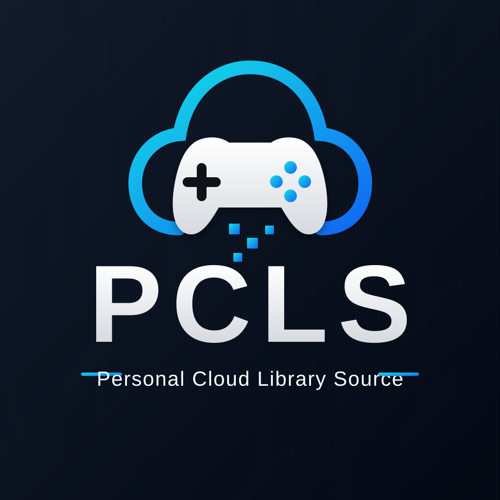

# PCLS branding

The approved Personal Cloud Library Source branding is available in three layouts.

## Plugin icon

Used for Playnite's extension listing, main menu, sidebar, and top-panel navigation. The build generates the transparent `icon.png` required by Playnite.

## Wide wordmark

Used for documentation, banners, dashboard headers, and repository presentation. The extension package also includes a transparent PNG copy under `Assets/pcls-logo-wide.png`.

## Full dark logo

Used for square promotional graphics and dark-background presentation.

The SVG files are repository-friendly presentation assets. The plugin's PNG files are generated deterministically from the checked-in encoded image sources during each build, avoiding checkerboard backgrounds while preserving true alpha transparency.
