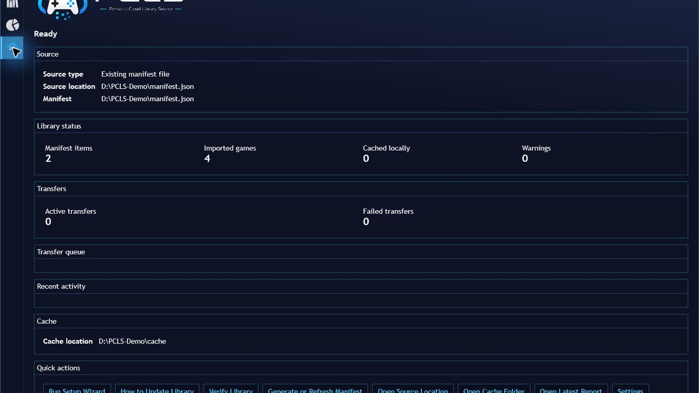
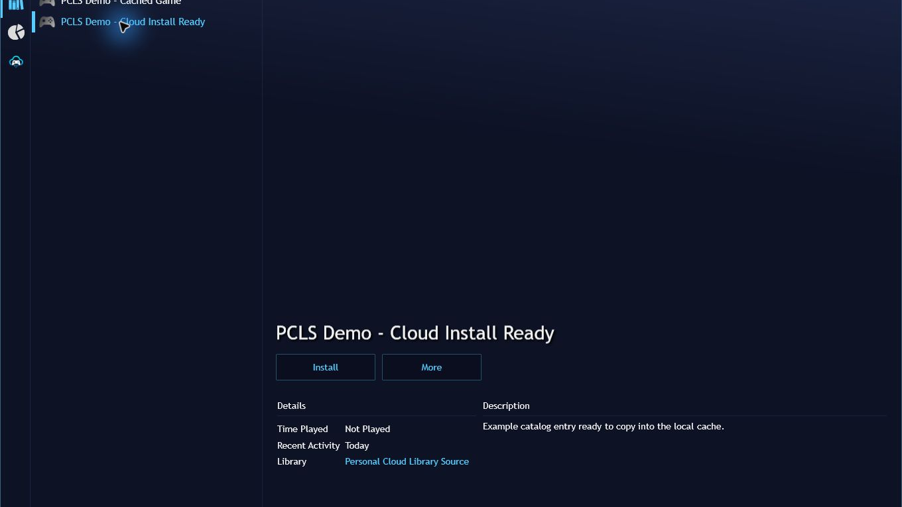

# Playnite add-on listing reference

## Short description

Import a user-supplied cloud, NAS, external-drive, or local manifest into Playnite and cache selected content locally.

## Long description

Personal Cloud Library Source imports a user-supplied manifest into Playnite's normal library view. Cloud-only entries can appear before download, receive Playnite metadata, be copied or downloaded to a guarded local cache, launch locally, and later be removed from the cache while keeping the catalog entry.

It supports `LocalFile`, `LocalFolder`, and `RcloneRemote`. Local roots can point at fixed disks, external drives, mapped drives, synced cloud folders, or UNC/NAS paths. Cloud providers are accessed through rclone configured separately by the user.

Desktop provides guided setup, verification, manifest generation, reports, diagnostics, and a transfer dashboard. Imported games use standard Playnite metadata and play/install/uninstall controllers; PCLS has no dedicated Fullscreen setup wizard or dashboard.

## Requirements

- Playnite and a valid JSON manifest.
- A writable local cache folder for install/download workflows.
- Source access and credentials supplied by the user.
- Rclone installed and configured only for `RcloneRemote`.

## Safety and limits

Cache uninstall refuses unsafe paths and never deletes source or remote content. PCLS does not stream games, auto-download an entire library, provide content, or provide cloud accounts. Users are responsible for only indexing content they own or have rights to use.

The live development version is 0.3.2 during 1.0 release-candidate qualification. Installed provider, Fullscreen, upgrade, and final package qualification must not be inferred from this listing.

